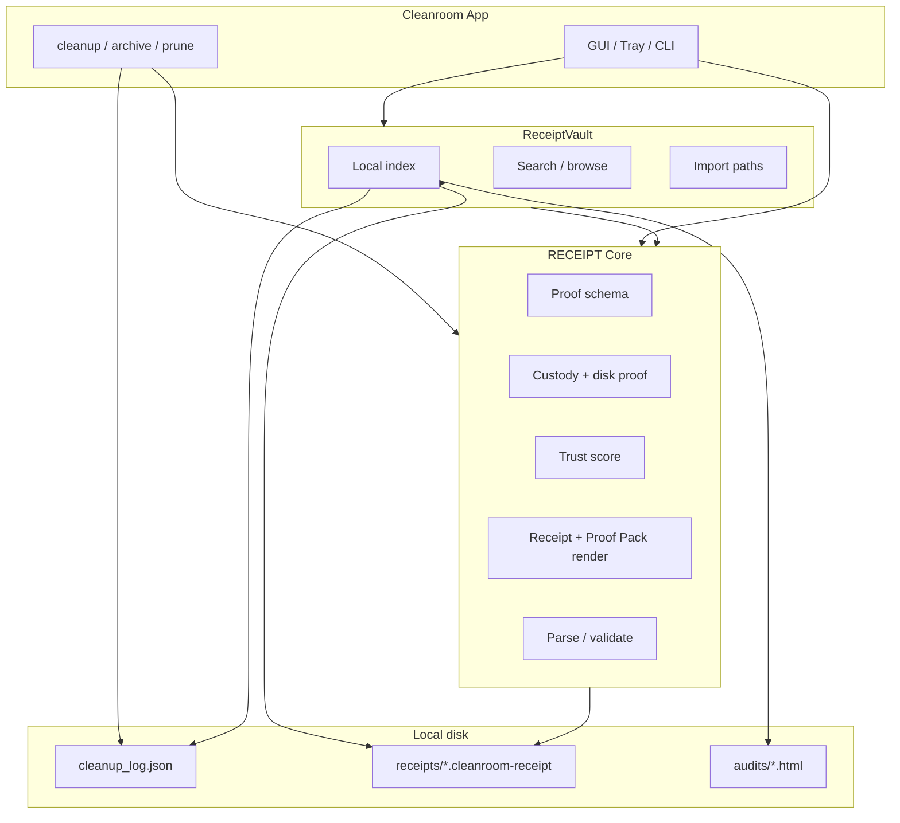

# RECEIPT Core + ReceiptVault — Planning Spec

**Status:** Planning only — no implementation in this branch  
**Baseline:** Cleanroom v1.0.4 (`main @ 9cda5da`)  
**Branch:** `docs/receipt-core-receiptvault-plan`

---

## Purpose

Cleanroom v1.0.4 ships a complete **local proof surface**: receipts, custody checks, activity ledger, Proof Pack, archive browser, and `.cleanroom-receipt` file type. That surface works, but proof logic is **embedded in the app** across several modules with overlapping responsibilities.

This document defines two future layers:

| Layer | Role |
|-------|------|
| **RECEIPT Core** | Reusable proof engine beneath Cleanroom — evidence models, custody verification, receipt rendering, trust scoring |
| **ReceiptVault** | Local proof library — import, index, search, and browse proof artifacts on disk |

**Goal:** Make proof a first-class, reusable substrate without changing Cleanroom’s archive-first doctrine or adding cloud/account/telemetry behavior.

**Not in scope for this branch:** App code, version bump, release tag, UI redesign, ReceiptVault implementation.

---

## Current state (v1.0.4)

### Proof-related modules today

| Module | Responsibility | Output / storage |
|--------|----------------|------------------|
| `proof.py` | OS-measured disk free space; custody verify over log entries | In-memory proof records |
| `ledger.py` | Activity feed from cleanup log; trust score; honest display caps | Derived from `cleanup_log.json` |
| `audit.py` | Proof Pack HTML export | `%LOCALAPPDATA%\Cleanroom\audits\audit_*.html` |
| `receipts.py` | Human-readable cleanup/prune receipts | `%LOCALAPPDATA%\Cleanroom\receipts\receipt_*.{cleanroom-receipt,txt}` |
| `archive_custody.py` | Archive browser records; prune recommendations; links to receipts | Reads log + receipt dir |
| `timeline.py` | Day-bucket rollback (Cleanroom Rewind) | Reads `cleanup_log.json` |
| `cleanup_log.json` | Canonical action log (archive, restore, prune) | Per-user config path |

### User-facing proof flows (shipped)

```text
Cleanup / Prune  →  cleanup_log.json  →  receipt file (.cleanroom-receipt)
                  →  proof.build_proof() embedded in receipt text
                  →  ledger activity feed + trust score
                  →  Proof Pack (HTML audit export)
                  →  Archive Browser (custody-linked rows)
                  →  Tray: Latest Receipt, Proof Pack
                  →  Shell: double-click .cleanroom-receipt
```

### Gaps that motivate RECEIPT Core / ReceiptVault

1. **No unified proof schema** — receipts are plain text; log entries are JSON; Proof Pack is HTML. Same facts, three shapes.
2. **No cross-artifact index** — finding “all proof for date X” requires scanning log + receipts + audits separately.
3. **No import path** — receipts copied from another PC or backup folder are not indexed or searchable.
4. **Engine coupling** — `receipts.py` imports `proof`; `audit.py` imports `ledger`; GUI wires all of them ad hoc.
5. **Extension without duplication** — future products (CLI tools, scheduled reports, ReceiptVault UI) would re-implement proof formatting.

---

## RECEIPT Core — definition

**RECEIPT Core** is the **reusable, local-only proof engine** that sits beneath Cleanroom (and potentially other tools). It owns *what proof means*, not *what Cleanroom cleans*.

### Responsibilities (in scope)

```text
[ ] Canonical proof record model (structured, versioned, serializable)
[ ] Evidence types: cleanup action, prune action, restore, custody snapshot, disk measurement
[ ] Custody verification API (artifact exists on disk?)
[ ] Trust score computation (honest caps when artifacts missing)
[ ] Receipt rendering (plain-text .cleanroom-receipt compatible)
[ ] Proof Pack rendering (HTML, self-contained)
[ ] Receipt validation / parse (legacy .txt + .cleanroom-receipt)
[ ] Stable public Python API surface (internal package or top-level module)
[ ] Zero network, zero account, zero telemetry
```

### Non-responsibilities (out of scope for Core)

```text
[ ] Cleanup, archive, prune, uninstaller behavior
[ ] GUI, tray, installer, file association
[ ] File indexing across arbitrary folders (ReceiptVault)
[ ] Cloud sync, sharing URLs, remote attestation
[ ] Binary/opaque receipt formats (stay plain-text human-readable)
```

### Proposed module boundary

```text
receipt_core/                    # future package name TBD
  schema.py      — ProofRecord, ActionEvidence, CustodyResult, ReceiptMeta
  custody.py     — verify_entries, disk measurement helpers (from proof.py)
  trust.py       — trust score + display caps (from ledger.py scoring)
  render.py      — format_receipt, format_proof_pack sections
  parse.py       — read/validate .cleanroom-receipt and legacy .txt
  serialize.py   — JSON canonical form for interchange / vault indexing
```

Cleanroom would **call Core** instead of duplicating logic; existing files become thin adapters during migration.

### Canonical proof record (draft shape)

Planning-only — not implemented:

```json
{
  "receipt_core_version": "1",
  "kind": "cleanup | prune | custody_check | audit_export",
  "issued_at": "2026-06-12T12:00:00",
  "issuer": "cleanroom",
  "issuer_version": "1.0.4",
  "summary": {
    "items_count": 12,
    "bytes_moved": 1073741824,
    "trust_score_display": "98/100"
  },
  "custody": {
    "total": 100,
    "verified": 98,
    "missing": 2,
    "bytes_in_custody": 5000000000
  },
  "disk_proof": {
    "volume": "C:\\",
    "before_free": 100000000000,
    "after_free": 101073741824
  },
  "actions": [ "..." ],
  "rendered_text": "optional cached plain-text body"
}
```

Plain-text `.cleanroom-receipt` files remain the **human-facing export**; Core adds an optional structured layer for Vault indexing without breaking readability.

### Migration principle

```text
New writes: Core generates structured record + renders .cleanroom-receipt
Old reads:  Core parse path accepts legacy .txt and v1.0.4 .cleanroom-receipt
No convert:  Do not bulk-migrate old receipts unless user explicitly imports to Vault
```

---

## ReceiptVault — definition

**ReceiptVault** is the **local proof library** — a user-owned index of proof artifacts on disk: receipts, Proof Packs, migration receipts, and (optionally) linked cleanup log excerpts.

Think: **library**, not cloud vault. Everything stays on the PC.

### Responsibilities (in scope)

```text
[ ] Index local proof artifacts (receipts dir, audits dir, user-selected import folders)
[ ] Import: add external .cleanroom-receipt / .txt / audit HTML to the index
[ ] Search: by date, kind (cleanup/prune), keyword, trust score, path fragment
[ ] Browse: chronological list, detail view (reuse in-app receipt viewer patterns)
[ ] Link: correlate receipt ↔ log window ↔ archive browser entry when possible
[ ] Export: copy receipt, open folder, regenerate Proof Pack from indexed period (future)
[ ] Local SQLite or JSON index under %LOCALAPPDATA%\Cleanroom\vault\
[ ] No network, no account, no telemetry
```

### Non-responsibilities

```text
[ ] Proof semantics (RECEIPT Core)
[ ] Cleanup / archive / prune execution
[ ] Cloud backup, sync, or sharing
[ ] Editing or mutating proof content (index is read-only on source files)
[ ] Replacing cleanup_log.json as source of truth
```

### Proposed storage layout (draft)

```text
%LOCALAPPDATA%\Cleanroom\
  receipts\              # existing — Core write target
  audits\                # existing — Proof Pack HTML
  vault\
    index.sqlite         # or index.json for v1 simplicity
    imports\             # optional copies of imported files (user choice)
    meta.json            # vault version, last scan, watched paths
```

### Relationship to Cleanroom GUI

```text
Phase 1 (Vault MVP):  Standalone browse/search panel or Activity tab extension
Phase 2:              Tray menu "Proof Library" opens Vault
Phase 3:              Import wizard for folder of receipts from backup/other PC
```

Vault **reads** via RECEIPT Core parse/validate; it does not re-implement custody math.

---

## Architecture (target)



---

## Phased roadmap (planning — do not start without explicit lane)

### Phase 0 — This document

- [x] Define RECEIPT Core and ReceiptVault boundaries
- [ ] Review + merge planning PR
- [ ] No code

### Phase 1 — RECEIPT Core extraction

- Extract schema + custody + trust + render from `proof.py`, `ledger.py`, `receipts.py`, `audit.py`
- Cleanroom calls Core; behavior parity tests (175+ tests stay green)
- No user-visible change

### Phase 2 — ReceiptVault MVP

- Local index of `%LOCALAPPDATA%\Cleanroom\receipts` and `audits`
- Search by date/kind; open in existing receipt viewer
- No import folder yet

### Phase 3 — Import + cross-machine proof

- Import folder; optional copy vs reference-only
- Correlate receipts to log timestamps
- Documentation for “proof portability”

### Phase 4 — Optional product surface

- Tray / Activity tab entry
- CLI: `cleanroom vault search "2026-06"`

Each phase = separate branch, gates, and release decision. **No monolithic ReceiptVault drop.**

---

## Doctrine constraints (unchanged)

```text
Archive-first — proof documents what was archived, not what was deleted
Local-only    — no cloud, account, API keys, or telemetry
Human-readable — receipts stay plain text; structured layer is additive
Honest trust  — never 100/100 when artifacts missing (ledger caps carry forward)
Reversible    — proof supports restore/Rewind narrative, not scare tactics
```

---

## Open questions (resolve before Phase 1)

| # | Question | Options |
|---|----------|---------|
| 1 | Package name | `receipt_core/` vs top-level `receiptcore.py` monolith for v1 |
| 2 | Structured sidecar | Embed JSON in receipt header vs separate `.cleanroom-receipt.json` |
| 3 | Vault index backend | SQLite vs JSON (SQLite better for search; JSON simpler for v1) |
| 4 | Import semantics | Copy to vault vs index-by-path (reference breaks if file moves) |
| 5 | Proof Pack regeneration | Vault triggers new audit from log slice vs static HTML only |
| 6 | Licensing / reuse | Core as internal module only vs eventual extractable library |

---

## Success criteria (future implementation lanes)

**RECEIPT Core done when:**

```text
Cleanroom uses Core for all new receipts and Proof Packs
Legacy .txt and .cleanroom-receipt still parse
pytest + release surface green
No cleanup/archive/prune behavior change
```

**ReceiptVault MVP done when:**

```text
User can search/browse all local receipts and audits without leaving Cleanroom
Import of one external receipt file works
Index rebuilds from receipts + audits dirs
Manual gate: no network; uninstall leaves vault data optional/ documented
```

---

## References (current codebase)

| File | Relevant today |
|------|----------------|
| `proof.py` | Custody verify, disk free measurement, `build_proof()` |
| `ledger.py` | Activity feed, trust score, `format_trust_score_display()` |
| `receipts.py` | `.cleanroom-receipt` write/read, prune receipts |
| `audit.py` | Proof Pack HTML |
| `archive_custody.py` | Receipt linking for archive browser |
| `ui/receipt_viewer.py` | In-app receipt display |
| `scripts/tray_receipt_manual_gate.ps1` | Shell association gate (v1.0.4) |

---

## Stop conditions (planning)

Stop and revise this spec if:

```text
Structured receipts would break plain-text readability
Vault requires cloud or account infrastructure
Core extraction would force cleanup behavior changes
Scope creeps into v1.0.5 release without explicit release cycle
```

---

*Planning spec only. Implementation requires a dedicated lane branch after this document is reviewed and merged.*
